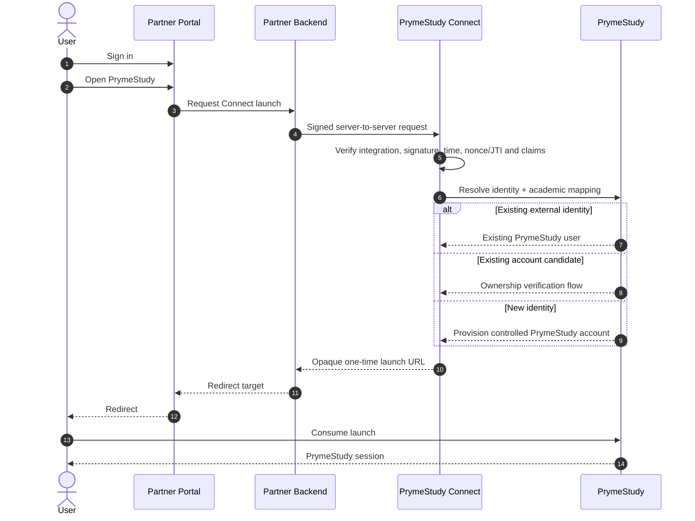

<p align="center">
  <a href="https://prymestudy.com" aria-label="PrymeStudy">
    
  </a>
</p>

<h1 align="center">PrymeStudy Connect</h1>

<p align="center">
  <strong>Enterprise identity, SIS/LMS, API and event integration for the PrymeStudy ecosystem.</strong>
</p>

<p align="center">
  Connect universities, departments, student associations, portals, student information systems, learning management systems and approved third-party services to PrymeStudy through one secure integration platform.
</p>

<p align="center">
  <a href="https://prymestudy.com">PrymeStudy</a>
  &nbsp;&middot;&nbsp;
  <a href="#platform-capabilities">Capabilities</a>
  &nbsp;&middot;&nbsp;
  <a href="#supported-languages">Languages</a>
  &nbsp;&middot;&nbsp;
  <a href="#security-baseline">Security</a>
  &nbsp;&middot;&nbsp;
  <a href="#open-source-boundary">Open source</a>
</p>

---

## What is PrymeStudy Connect?

**PrymeStudy Connect** is the institutional and developer integration layer for PrymeStudy.

It gives approved academic organisations a consistent way to integrate existing infrastructure with PrymeStudy without replacing their current portals, SIS, LMS or authentication systems.

Connect covers both identity and institutional data exchange:

```text
Institution / Partner
        │
        ├── Student portal / SSO
        ├── SIS
        ├── LMS
        ├── ERP / academic system
        ├── Custom backend
        └── Event consumers
                │
                ▼
        PrymeStudy Connect
                │
        ┌───────┼────────┐
        │       │        │
        ▼       ▼        ▼
     Identity   APIs   Webhooks
        │       │        │
        └───────┼────────┘
                ▼
            PrymeStudy
```

PrymeStudy remains authoritative for PrymeStudy accounts, account ownership, institutional mapping, permissions, sessions, entitlements and canonical PrymeStudy records.

The partner remains authoritative for the data and identity claims it is approved to provide.

---

## Platform capabilities

PrymeStudy Connect is one platform with several integration capabilities.

### Identity & Partner SSO

Allow an authenticated student, lecturer or approved institutional user to move from an existing partner portal into PrymeStudy without registering or signing in again.

```text
Partner portal session
        ↓
Signed server-to-server launch request
        ↓
PrymeStudy Connect verifies partner + request
        ↓
External identity resolved / created / safely linked
        ↓
Academic mapping applied
        ↓
Short-lived one-time launch
        ↓
Normal PrymeStudy session
```

### SIS & LMS integration

Synchronize approved institutional data through scoped APIs and controlled data-exchange workflows, including:

- students and institutional identities;
- colleges, faculties, schools, departments and programmes;
- academic levels and cohorts;
- courses and course offerings;
- enrolments and registrations;
- attendance where authorized;
- other academic records exposed by an approved integration scope.

### APIs

Server-to-server API access is isolated per integration and governed by explicit scopes, environment, institution, application identity and policy.

Examples of capability scopes include:

```text
connect:sso.launch
students:read
students:write
courses:read
enrollments:read
enrollments:write
webhooks:manage
```

An integration receives only the capabilities required for its approved use case.

### Webhooks

PrymeStudy can deliver signed events to approved HTTPS endpoints so partner systems can react to changes without polling.

Webhook consumers must verify signatures, reject replayed deliveries and process events idempotently.

### Data exchange

Controlled import/export workflows support migration, synchronization and reconciliation while preserving external identifiers and preventing unreviewed writes into canonical academic records.

### Academic mapping

Partners send stable codes they control. They do not depend on PrymeStudy database primary keys.

```text
Partner code                  PrymeStudy canonical record
─────────────────────────────────────────────────────────
LASUSTECH                  →  Institution
COMPUTER_SCIENCE           →  Department
BSC_COMPUTER_SCIENCE       →  Programme
300                        →  Level / cohort
```

Missing or ambiguous mappings fail safely and require configuration or review. PrymeStudy must never silently attach a user to an arbitrary academic record.

---

## SSO flow



### Browser boundary

The browser must never receive:

- partner private signing keys or client secrets;
- raw credentials;
- raw signed student identity payloads in URLs;
- internal PrymeStudy mapping identifiers;
- reusable authentication grants.

The browser receives only the minimum short-lived data required to complete the approved handoff.

---

## Identity contract

Every partner identity must include a stable immutable external subject.

Example:

```json
{
  "sub": "student-immutable-uuid",
  "matric_number": "LASUSTECH/2026/001",
  "first_name": "Ada",
  "last_name": "Student",
  "email": "ada@example.edu",
  "level": "300",
  "institution": "LASUSTECH",
  "department": "COMPUTER_SCIENCE",
  "programme": "BSC_COMPUTER_SCIENCE"
}
```

`sub` is the partner-controlled immutable identity key. Email addresses, phone numbers, surnames, matric display formats and academic level can change without changing the external subject.

Automatic account linking must never rely on name matching alone.

---

## Identity lifecycle

Connect supports three identity paths.

### Existing external identity

When `(integration, external subject)` is already linked, Connect resolves the same PrymeStudy account and records the new activity.

### Existing PrymeStudy account

A strong candidate may be detected from approved identifiers such as institution + normalized matric number or a verified email address. Account ownership must be confirmed whenever ambiguity or account-takeover risk exists.

### New PrymeStudy account

When no safe candidate exists, PrymeStudy can provision the user from approved partner claims and establish the external identity link in the same logical transaction.

Institution-controlled academic fields and user-controlled profile fields remain governed by explicit field-authority rules.

---

## Supported languages

PrymeStudy Connect is **language-agnostic at the protocol level**. Any secure server-side application capable of HTTPS and the required cryptographic operations can integrate with Connect.

Official integration languages are:

| Language / runtime | Primary use |
|---|---|
| **PHP / Laravel** | University portals, departmental systems, Laravel applications and traditional PHP backends |
| **TypeScript / Node.js** | Node.js, Express, NestJS, Fastify, Next.js server runtimes and modern portal backends |
| **Python** | Django, Flask, FastAPI, research/institutional systems and automation services |
| **Raw HTTPS** | Java, .NET, Go, Ruby, Rust and any other backend using the published protocol |

### Server-side only

PrymeStudy Connect credentials and signing keys belong on trusted backends.

A React, Vue, Angular, mobile or browser client may call its own backend, but it must never embed a Connect client secret or private signing key.

---

## Repository layout

This repository contains the public integration contract, SDKs, examples, schemas and security guidance for PrymeStudy Connect.

```text
prymestudy-connect/
├── README.md
├── LICENSE
├── SECURITY.md
├── CONTRIBUTING.md
├── docs/
│   ├── getting-started.md
│   ├── concepts.md
│   ├── authentication.md
│   ├── sso.md
│   ├── sis-integration.md
│   ├── academic-mapping.md
│   ├── webhooks.md
│   ├── environments.md
│   ├── errors.md
│   └── security.md
├── sdk/
│   ├── php/
│   ├── typescript/
│   └── python/
├── examples/
│   ├── laravel/
│   ├── node/
│   ├── python/
│   └── raw-http/
└── schemas/
    ├── launch-request.schema.json
    ├── academic-claims.schema.json
    └── webhook.schema.json
```

The public protocol is the source of truth. SDKs implement that protocol consistently rather than defining separate language-specific behavior.

---

## Integration environments

Every integration is isolated by environment.

```text
Sandbox / Test
├── separate credentials
├── test callbacks
├── test mappings
├── test webhooks
└── non-production data policy

Production / Live
├── production credentials
├── approved callbacks
├── production mappings
├── production webhooks
└── production security policy
```

Test credentials must never authenticate against production resources.

Production access is permission-controlled, reviewable, revocable and auditable.

---

## Credential model

Each external application or system receives its own identity and credentials.

Do not share one credential across unrelated portals, departments, SIS instances or applications.

Example isolation:

```text
LASUSTECH
├── Central SIS Production
├── Central SIS Sandbox
├── NAMSSN Portal
├── Computer Science Portal
└── Engineering Portal
```

A compromised integration can therefore be disabled or rotated without disabling every other LASUSTECH connection.

Credentials support revocation, rotation, expiry and environment separation.

For high-assurance production integrations, asymmetric request signing is the preferred trust model so the partner's private signing key never needs to be stored by PrymeStudy.

Shared-secret/HMAC authentication can be supported where appropriate under an explicitly defined compatibility profile, with strict replay protection and key rotation.

---

## Security baseline

PrymeStudy Connect is designed around least privilege, tenant isolation, strong server-to-server authentication and complete security auditability.

Security requirements include:

- HTTPS/TLS for all production traffic;
- cryptographically secure integration credentials;
- asymmetric request signing for high-assurance integrations;
- short-lived signed requests;
- timestamp validation and bounded clock skew;
- nonce/JTI replay prevention;
- one-time launch consumption;
- strict audience and integration binding;
- exact callback and return URL allow-lists;
- request-body and payload limits;
- schema and claim validation;
- scoped API authorization;
- institution and integration isolation;
- rate limiting and abuse controls;
- idempotency for mutation and event workflows;
- credential expiry, rotation and revocation;
- secret values displayed only when policy permits and never logged;
- private keys, secrets, OTPs and full authentication tokens excluded from logs;
- explicit ownership verification for account linking;
- no automatic identity linking by name;
- signed webhook delivery and verification;
- security-event and administrative audit trails;
- step-up authentication for sensitive administrative actions;
- production enablement controlled independently from sandbox access.

Enterprise deployments can layer controls such as IP allow-listing, mTLS, enterprise federation and institution-specific policy where required.

---

## Enterprise federation

PrymeStudy Connect supports institutions at different levels of identity maturity.

The Connect partner-launch protocol gives institutions without a full identity-provider stack a secure integration path.

Where an institution already operates enterprise identity infrastructure, Connect can interoperate through standard federation patterns including:

- OpenID Connect;
- OAuth-based service authorization;
- SAML 2.0;
- institution-managed public keys and certificate-based trust;
- mTLS for high-assurance system-to-system deployments.

Connect does not require an institution to abandon an existing identity provider, SIS or LMS.

---

## SIS / API trust model

SSO capability does not automatically grant academic-data write access.

An integration may be approved for one capability and denied another.

Example:

```text
Computer Science Portal
├── connect:sso.launch       ✓
├── students:read            ✓
├── students:write           ✗
├── enrollments:read         ✓
├── enrollments:write        ✗
└── webhooks:manage          ✓
```

This separation prevents identity federation from becoming unrestricted institutional-data access.

---

## Webhook security

Webhook consumers must treat every delivery as untrusted until verified.

A valid consumer implementation should:

1. verify the PrymeStudy signature using the configured verification key or secret;
2. validate the event timestamp;
3. reject replayed delivery identifiers;
4. enforce payload-size limits;
5. process idempotently;
6. return a bounded response time;
7. avoid logging sensitive payloads unnecessarily.

PrymeStudy may retry eligible events according to the published delivery policy.

---

## Open-source boundary

PrymeStudy Connect is open at the integration layer so institutions can inspect, audit and implement the protocol without depending on hidden client behavior.

### Public / open-source

- integration protocol documentation;
- SDK source code;
- schemas and data contracts;
- signing and verification clients;
- nonce/JTI and timestamp handling;
- request and response models;
- webhook verification;
- error catalogue;
- sandbox/reference examples;
- compatibility and migration guidance;
- secure implementation guidance.

### Private PrymeStudy security authority

- account-matching heuristics;
- anti-abuse and fraud systems;
- risk scoring;
- internal authentication/session implementation;
- internal production infrastructure;
- production secrets and signing material;
- private administrative/support tooling;
- sensitive operational security controls;
- controls whose disclosure would materially weaken the platform.

Open source means the integration contract is inspectable and interoperable. It does not expose PrymeStudy's private security authority.

---

## Reference architecture

The reference institutional model supports department-level, association-level and institution-wide deployments without changing the Connect protocol.

Example:

```text
LASUSTECH
│
├── Central SIS
├── Central Student Portal
├── NAMSSN Portal
├── Computer Science Portal
└── Other approved systems
        │
        ▼
  PrymeStudy Connect
        │
        ▼
     PrymeStudy
```

NAMSSN/LASUSTECH serves as a reference integration use case, not as a hard-coded assumption in the protocol or SDKs.

A second department, another institution or a different SIS should integrate through configuration, credentials, scopes and mappings rather than a separate PrymeStudy-specific implementation.

---

## Operational principles

PrymeStudy Connect follows these platform rules:

1. **One integration, one security identity.** Never reuse credentials across unrelated systems.
2. **Least privilege by default.** Every API, webhook and identity capability is explicitly scoped.
3. **No secrets in browsers.** Connect authentication is server-side.
4. **No raw PII in redirect URLs.** Browser handoffs use opaque, short-lived launch material.
5. **No silent account takeover.** Existing-account linking requires strong evidence and verification where needed.
6. **Canonical academic mapping.** Partners send stable external codes, not PrymeStudy database IDs.
7. **Environment isolation.** Test and production trust are separate.
8. **Audit everything sensitive.** Credential, mapping, identity and production-access changes are attributable.
9. **Standards where standards fit.** OIDC/OAuth/SAML and strong cryptographic primitives are preferred over proprietary alternatives when appropriate.
10. **Protocol before SDK.** Language SDKs implement the same stable Connect contract.

---

## Contributing

Contributions to the public protocol, SDKs, schemas, examples and documentation must preserve the PrymeStudy Connect security model.

Do not include:

- production credentials;
- real student records;
- private PrymeStudy server implementation;
- internal anti-abuse logic;
- secrets or private keys;
- examples that teach unsafe browser-side credential handling.

Security-sensitive changes should include tests for signing, verification, replay protection, idempotency, scope enforcement and error handling where applicable.

---

## Security disclosures

Do **not** disclose suspected vulnerabilities, credentials, private keys, student information or exploit details in a public issue.

Security reports should use PrymeStudy's private security reporting channel defined in `SECURITY.md`.

---

## About PrymeStudy

[PrymeStudy](https://prymestudy.com) is building a connected academic platform for students and institutions — combining academic infrastructure, learning, institutional operations and intelligent study experiences in one ecosystem.

PrymeStudy Connect is the enterprise integration layer that allows existing academic systems to participate in that ecosystem without surrendering their own infrastructure or security authority.

---

<p align="center">
  <strong>One secure integration layer for institutions, academic systems and the PrymeStudy ecosystem.</strong>
</p>
