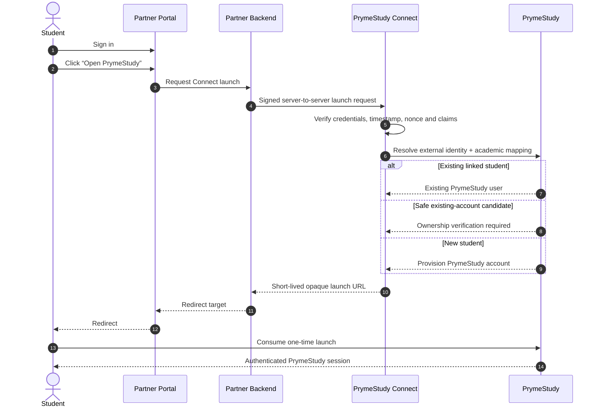

<p align="center">
  <a href="https://prymestudy.com" aria-label="PrymeStudy">
    
  </a>
</p>

<h1 align="center">PrymeStudy Connect</h1>

<p align="center">
  <strong>Secure institutional SSO and partner integrations for PrymeStudy.</strong>
</p>

<p align="center">
  Connect university, department, association, and academic portals to PrymeStudy without rebuilding authentication or exposing student credentials.
</p>

<p align="center">
  <a href="https://prymestudy.com">PrymeStudy</a>
  &nbsp;&middot;&nbsp;
  <a href="#how-it-works">How it works</a>
  &nbsp;&middot;&nbsp;
  <a href="#sdk-roadmap">SDK roadmap</a>
  &nbsp;&middot;&nbsp;
  <a href="#security-model">Security</a>
</p>

---

## What is PrymeStudy Connect?

**PrymeStudy Connect** is the public developer layer for integrating approved academic portals with PrymeStudy.

A university, department, student association, or other approved academic partner can keep its existing portal and authentication system while giving authenticated students a secure path into PrymeStudy.

The partner authenticates its own student. PrymeStudy remains responsible for PrymeStudy accounts, account ownership, institutional mapping, permissions, and PrymeStudy session creation.

The intended experience is simple:

```text
Student signs in to partner portal
        ↓
Student clicks “Open PrymeStudy”
        ↓
Partner backend creates a signed Connect launch
        ↓
PrymeStudy verifies the partner and student identity
        ↓
PrymeStudy creates or safely links the student account
        ↓
Academic profile is mapped
        ↓
Student enters PrymeStudy
```

Returning students should normally move from their partner portal into PrymeStudy in one action after the identity link has been established.

---

## Why it exists

PrymeStudy Connect is designed for institutions and academic communities that already have working portals and do **not** need to replace them just to use PrymeStudy.

Instead of asking every department to rebuild its student system around PrymeStudy, Connect provides a reusable integration layer.

For example, the same Connect architecture can support:

- a Mathematics departmental portal;
- a Computer Science departmental portal;
- a student association portal;
- a university-wide student portal;
- another institution with its own identity system.

Each integration receives its own credentials, mappings, permissions, and audit history.

---

## How it works



### Important design rule

The browser never receives the partner secret and should never receive raw student identity data in the launch URL.

Secrets stay on trusted server-side systems.

---

## Academic mapping

Partners should send their own stable external codes — **not PrymeStudy database IDs**.

Example partner claims:

```json
{
  "sub": "student-immutable-uuid",
  "matric_number": "LASUSTECH/2026/001",
  "first_name": "Ada",
  "last_name": "Student",
  "email": "ada@example.edu",
  "level": "300",
  "institution": "LASUSTECH",
  "department": "COMPUTER_SCIENCE",
  "programme": "COMPUTER_SCIENCE"
}
```

PrymeStudy resolves those values to its canonical academic structure.

```text
Partner code                  PrymeStudy record
────────────────────────────────────────────────────────
LASUSTECH                  →  Institution
COMPUTER_SCIENCE           →  Department
COMPUTER_SCIENCE           →  Programme
300                        →  Level / cohort
```

This keeps integrations portable and prevents partners from depending on internal PrymeStudy primary keys.

---

## Identity lifecycle

Connect supports three primary identity paths.

### Returning student

If the partner's immutable external subject is already linked to a PrymeStudy user, the student can proceed directly into PrymeStudy.

### Existing PrymeStudy account

If a strong candidate already exists, PrymeStudy follows its account-ownership verification policy before creating the permanent link.

A matching name is **never** enough to link accounts automatically.

### New student

If no safe existing account exists, PrymeStudy may provision a new account from approved partner claims and create the external identity link as part of the same logical flow.

---

## What this repository will contain

This repository is intentionally limited to the **public integration surface**.

```text
prymestudy-connect/
├── README.md
├── docs/
│   ├── getting-started.md
│   ├── authentication.md
│   ├── sso-flow.md
│   ├── account-linking.md
│   ├── academic-mapping.md
│   ├── security.md
│   └── errors.md
├── sdk/
│   ├── php/
│   ├── javascript/
│   └── python/
└── examples/
    ├── laravel/
    ├── node/
    └── php/
```

### Public / open-source surface

- partner-safe protocol documentation;
- SDK source code;
- request-signing clients;
- timestamp and nonce handling;
- request submission helpers;
- launch/redirect helpers;
- error normalization;
- sandbox examples;
- migration and integration guides.

### Kept private inside PrymeStudy

- internal account-matching heuristics;
- anti-abuse and fraud controls;
- private authentication/session implementation;
- production credentials and secrets;
- internal operations/admin tooling;
- security controls whose disclosure would materially weaken the platform.

Open integration does **not** mean exposing PrymeStudy's security authority.

---

## SDK roadmap

> **Status:** Public developer foundation. SDK packages are not yet published.

The intended developer experience is:

### PHP / Laravel

```bash
composer require prymestudy/connect
```

```php
use PrymeStudy\Connect\PrymeStudy;

return PrymeStudy::launch([
    'subject' => (string) $student->connect_subject,
    'email' => $student->email,
    'first_name' => $student->first_name,
    'last_name' => $student->last_name,
    'matric_number' => $student->matric_number,
    'level' => $student->level,
    'institution' => 'LASUSTECH',
    'department' => 'COMPUTER_SCIENCE',
    'programme' => 'COMPUTER_SCIENCE',
]);
```

### Node.js / TypeScript

Planned package:

```bash
npm install @prymestudy/connect
```

The package is intended for **trusted server-side Node environments**. Partner secrets must never be shipped to browser JavaScript.

### Python

Planned package:

```bash
pip install prymestudy-connect
```

The initial implementation priority is the PHP/Laravel SDK, followed by Node and Python clients.

---

## Credentials

Approved integrations will receive environment-specific credentials conceptually similar to:

```env
PRYMESTUDY_CONNECT_CLIENT_ID=ps_test_...
PRYMESTUDY_CONNECT_CLIENT_SECRET=ps_test_secret_...
PRYMESTUDY_CONNECT_ENVIRONMENT=sandbox
```

Production credentials are separate from sandbox credentials.

Never commit credentials to source control.

---

## Security model

PrymeStudy Connect is designed around a server-to-server trust boundary.

Core requirements include:

- HTTPS in production;
- server-side credential usage only;
- short-lived requests and launches;
- timestamp validation;
- nonce/JTI replay prevention;
- one-time launch consumption;
- strict callback/return URL allow-listing;
- rate limiting;
- credential rotation and revocation;
- auditability of sensitive integration actions;
- explicit ownership verification for account linking;
- no secrets in browser code, query strings, logs, or analytics;
- no automatic linking based on a student's name.

Partners should create a separate integration/client for each external system rather than sharing one credential across unrelated applications.

---

## PrymeStudy Connect vs Institutional Connect

PrymeStudy has two related but different integration concerns.

| | PrymeStudy Connect | Institutional Connect |
|---|---|---|
| Primary purpose | Student identity + SSO | System-to-system academic data exchange |
| Typical action | “Open PrymeStudy” | Sync students, courses, enrolments or attendance |
| Trust model | Signed launch + identity linking | Scoped API clients + webhooks |
| Browser involved | Only for final one-time launch consumption | Usually no |
| Partner secret in browser | Never | Never |

They can coexist in the same institution without being the same protocol.

---

## Reference implementation

The first reference integration is planned around a LASUSTECH departmental/student portal use case.

The reusable Connect core must remain institution-agnostic: no LASUSTECH-, department-, or association-specific assumptions should be embedded into the generic SDK or protocol.

A Computer Science portal, Mathematics portal, another LASUSTECH department, or another university should be able to integrate through configuration rather than a new Connect implementation.

---

## Enterprise federation

PrymeStudy Connect is intended to provide a practical integration path for partners that do not run a full identity-provider stack.

It is **not** intended to replace industry federation standards.

Future enterprise integrations may support standards such as:

- OpenID Connect;
- OAuth-based institutional federation where appropriate;
- SAML 2.0.

---

## Project status

This repository currently represents the public developer foundation for PrymeStudy Connect.

Planned milestones:

1. publish partner-safe protocol documentation;
2. ship the PHP/Laravel reference SDK;
3. provide a working Laravel example integration;
4. publish sandbox onboarding documentation;
5. ship Node.js support;
6. ship Python support;
7. version and release the public protocol/SDKs;
8. expand enterprise federation support when required.

Do not treat unreleased package names shown in this README as currently available packages.

---

## Contributing

PrymeStudy Connect is intended to be developed in the open at the SDK and protocol layer.

Before opening a contribution:

- do not include production credentials or student data;
- do not copy private PrymeStudy server implementation into this repository;
- keep examples institution-agnostic unless they are explicitly marked as reference examples;
- preserve the server-side secret boundary;
- include tests for signing, validation, replay protection, and error handling when relevant.

A fuller contribution guide will be added as the first SDK implementation lands.

---

## Security disclosures

Please do **not** publish suspected vulnerabilities, credentials, student information, or exploit details in a public issue.

A dedicated security policy and private reporting path will be published before the first production SDK release.

---

## About PrymeStudy

[PrymeStudy](https://prymestudy.com) is building a connected academic platform for students and institutions — bringing academic structure, learning tools, institutional workflows, and intelligent study experiences into one system.

PrymeStudy Connect is the integration layer that lets existing academic portals connect into that ecosystem without surrendering their own authentication authority.

---

<p align="center">
  <strong>Build once. Connect departments, institutions, and academic communities to PrymeStudy securely.</strong>
</p>
